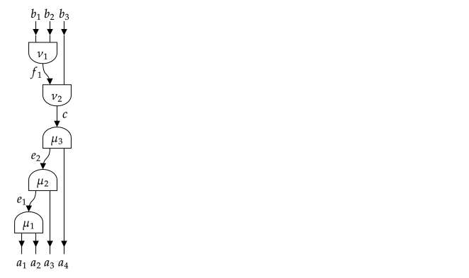
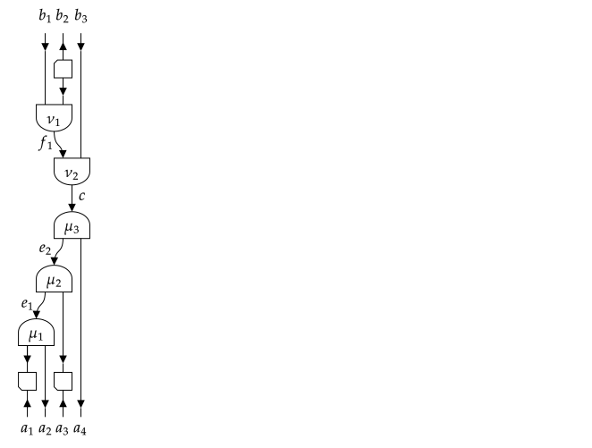
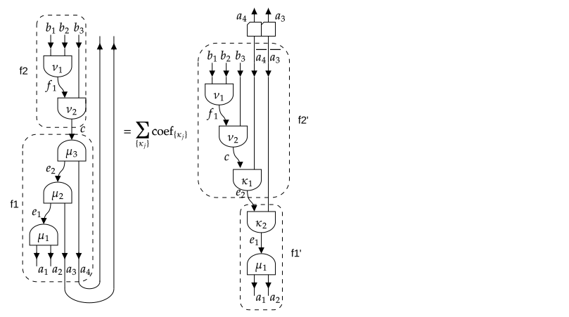

# [Sectors, representation spaces and fusion trees](@id s_sectorsrepfusion)

```@setup sectors
using TensorKit
using LinearAlgebra
```

Symmetries in a physical system often result in tensors which are invariant under the action
of the symmetry group, where this group acts as a tensor product of group actions on every
tensor index separately. The group action on a single index, or thus, on the corresponding
vector space, can be decomposed into irreducible representations (irreps). Here, we
restrict to unitary representations, such that the corresponding vector spaces also have a
natural Euclidean inner product. In particular, the Euclidean inner product between two
vectors is invariant under the group action and thus transforms according to the trivial
representation of the group.

The corresponding vector spaces will be canonically represented as
``V = ⨁_a ℂ^{n_a} ⊗ R_{a}``, where ``a`` labels the different irreps, ``n_a`` is the number
of times irrep ``a`` appears and ``R_a`` is the vector space associated with irrep ``a``.
Irreps are also known as spin sectors (in the case of ``\mathsf{SU}_2``) or charge sectors
(in the case of ``\mathsf{U}_1``), and we henceforth refer to ``a`` as a sector. As
discussed in the section on [categories](@ref s_categories), and briefly summarized below,
the approach we follow does in fact go beyond the case of irreps of groups, and sectors
would more generally correspond to simple objects in a unitary ribbon fusion category.
Nonetheless, every step can be appreciated by using the representation theory of
``\mathsf{SU}_2`` or ``\mathsf{SU}_3`` as example. For practical reasons, we assume that
there is a canonical order of the sectors, so that the vector space ``V`` is
completely specified by the values of ``n_a``.

The gain in efficiency (both in memory occupation and computation time) obtained from using
(technically: equivariant) tensor maps is that, by Schur's lemma, they are block diagonal in
the basis of coupled sectors. To exploit this block diagonal form, it is however essential
that we know the basis transform from the individual (uncoupled) sectors appearing in the
tensor product form of the domain and codomain, to the totally coupled sectors that label
the different blocks. We refer to the latter as block sectors. The transformation from the
uncoupled sectors in the domain (or codomain) of the tensor map to the block sector is
encoded in a fusion tree (or splitting tree). Essentially, it is a sequential application of
pairwise fusion as described by the group's
[Clebsch–Gordan (CG) coefficients](https://en.wikipedia.org/wiki/Clebsch–Gordan_coefficients).
However, it turns out that we do not need the actual CG coefficients, but only how they
transform under transformations such as interchanging the order of the incoming irreps or
interchanging incoming and outgoing irreps. This information is known as the topological
data of the group, i.e. mainly the F-symbols, which are also known as recoupling
coefficients or [6j-symbols](https://en.wikipedia.org/wiki/6-j_symbol) (more accurately, the
F-symbol is actually
[Racah's W-coefficients](https://en.wikipedia.org/wiki/Racah_W-coefficient) in the case of
``\mathsf{SU}_2``).

Below, we describe how to specify a certain type of sector and what information about them
needs to be implemented. Then, we describe how to build a space ``V`` composed of a direct
sum of different sectors. In the third section, we explain the details of fusion trees, i.e.
their construction and manipulation. Finally, we elaborate on the case of general fusion
categories and the possibility of having fermionic or anyonic twists. But first, we provide
a quick theoretical overview of the required data of the representation theory of a group.
We refer to the section on [categories](@ref s_categories), and in particular the
subsection on [topological data of a unitary fusion category](@ref ss_topologicalfusion),
for further details.

## [Representation theory and unitary fusion categories](@id ss_representationtheory)

Let the different irreps or sectors be labeled as ``a``, ``b``, ``c``, … First and foremost,
we need to specify the *fusion rules* ``a ⊗ b = ⨁ N^{ab}_{c} c`` with ``N^{ab}_{c}`` some
non-negative integers. There should always exists a unique trivial sector ``u`` (called the
identity object ``I`` or ``1`` in the language of categories) such that
``a ⊗ u = a = u ⊗ a``. Furthermore, there should exist a unique sector ``\bar{a}``
such that ``N^{a\bar{a}}_{u} = 1``, whereas for all ``b \neq \bar{a}``,
``N^{ab}_{u} = 0``. For unitary irreps of groups, ``\bar{a}`` corresponds to the
complex conjugate of the representation ``a``, or a representation isomorphic to it. For
example, for the representations of ``\mathsf{SU}_2``, the trivial sector corresponds to
spin zero and all irreps are self-dual (i.e. ``a = \bar{a}``), meaning that the
conjugate representation is isomorphic to the non-conjugated one (they are however not
equal but related by a similarity transform).

The meaning of the fusion rules is that the space of transformations ``R_a ⊗ R_b → R_c``
(or vice versa) has dimension ``N^{ab}_c``. In particular, we assume the existence of a
basis consisting of unitary tensor maps ``X^{ab}_{c,μ} : R_c → R_a ⊗ R_b`` with
``μ = 1, …, N^{ab}_c`` such that

``(X^{ab}_{c,μ})^† X^{ab}_{c,ν} = δ_{μ,ν} \mathrm{id}_{R_c}``

and

``\sum_{c} \sum_{μ = 1}^{N^{ab}_c} X^{ab}_{c,μ} (X^{ab}_{c,μ})^\dagger = \mathrm{id}_{R_a ⊗ R_b}``

The tensors ``X^{ab}_{c,μ}`` are the splitting tensors, their hermitian conjugate are the
fusion tensors. They are only determined up to a unitary basis transform within the space,
i.e. acting on the multiplicity label ``μ = 1, …, N^{ab}_c``. For ``\mathsf{SU}_2``, where
``N^{ab}_c`` is zero or one and the multiplicity labels are absent, the entries of
``X^{ab}_{c,μ}`` are precisely given by the CG coefficients. The point is that we do not
need to know the tensors ``X^{ab}_{c,μ}`` explicitly, but only the topological data of
(the representation category of) the group, which describes the following transformation:

*   F-move or recoupling: the transformation between ``(a ⊗ b) ⊗ c`` to ``a ⊗ (b ⊗ c)``:

    ``(X^{ab}_{e,μ} ⊗ \mathrm{id}_c) ∘ X^{ec}_{d,ν} = ∑_{f,κ,λ} [F^{abc}_{d}]_{e,μν}^{f,κλ} (\mathrm{id}_a ⊗ X^{bc}_{f,κ}) ∘ X^{af}_{d,λ}``

*   [Braiding](@ref ss_braiding) or permuting as defined by
    ``τ_{a,b}: R_a ⊗ R_b → R_b ⊗ R_a``:
    ``τ_{R_a,R_b} ∘ X^{ab}_{c,μ} = ∑_{ν} [R^{ab}_c]^ν_μ X^{ba}_{c,ν}``

The dimensions of the spaces ``R_a`` on which representation ``a`` acts are denoted as
``d_a`` and referred to as quantum dimensions. In particular ``d_u = 1`` and
``d_a = d_{\bar{a}}``. This information is also encoded in the F-symbol as
``d_a = | [F^{a \bar{a} a}_a]^u_u |^{-1}``. Note that there are no multiplicity labels
in that particular F-symbol as ``N^{a\bar{a}}_u = 1``.

There is a graphical representation associated with the fusion tensors and their manipulations, which we summarize here:


As always, we refer to the subsection on [topological data of a unitary fusion category](@ref ss_topologicalfusion) for further details.

Finally, for the implementation, it will be useful to distinguish between an number of
different possibilities regarding the fusion rules. If, for every ``a`` and ``b``, there is
a unique ``c`` such that ``a ⊗ b = c`` (i.e. ``N^{ab}_{c} = 1`` and ``N^{ab}_{c′} = 0`` for
all other ``c′``), the category is abelian. Indeed, the representations of a group have this
property if and only if the group multiplication law is commutative. In that case, all
spaces ``R_{a}`` associated with the representation are one-dimensional and thus trivial. In
all other cases, the category is non-abelian. We find it useful to further distinguish
between categories which have all ``N^{ab}_c`` equal to zero or one (such that no
multiplicity labels are needed), e.g. the representations of ``\mathsf{SU}_2``, and those
where some ``N^{ab}_c`` are larger than one, e.g. the representations of ``\mathsf{SU}_3``.

## [Sectors](@id ss_sectors)

We introduce a new abstract type to represent different possible sectors
```julia
abstract type Sector end
```
Any concrete subtype of `Sector` should be such that its instances represent a consistent
set of sectors, corresponding to the irreps of some group, or, more generally, the simple
objects of a (unitary) fusion category, as reviewed in the subsections on
[fusion categories](@ref ss_fusion) and their [topological data](@ref ss_topologicalfusion)
within the introduction to [category theory](@ref s_categories). Throughout TensorKit.jl,
the method `sectortype` can be used to query the subtype of `Sector` associated with a
particular object, i.e. a vector space, fusion tree, tensor map, or a sector. It works on
both instances and in the type domain, and its use will be illustrated further on.

The minimal data to completely specify a type of sector are
*   the fusion rules, i.e. `` a ⊗ b = ⨁ N^{ab}_{c} c ``; this is implemented by a function
    [`Nsymbol(a,b,c)`](@ref)
*   the list of fusion outputs from ``a ⊗ b``; while this information is contained in
    ``N^{ab}_c``, it might be costly or impossible to iterate over all possible values of
    `c` and test `Nsymbol(a,b,c)`; instead we implement for `a ⊗ b` to return an iterable
    object (e.g. tuple, array or a custom Julia type that listens to `Base.iterate`) and
    which generates all `c` for which ``N^{ab}_c ≠ 0`` (just once even if ``N^{ab}_c>1``)
*   the identity object `u`, such that ``a ⊗ u = a = u ⊗ a``; this is implemented by the
    function `one(a)` (and also in type domain) from Julia Base
*   the dual or conjugate representation ``\overline{a}`` for which
    ``N^{a\bar{a}}_{u} = 1``; this is implemented by `conj(a)` from Julia Base;
    `dual(a)` also works as alias, but `conj(a)` is the method that should be defined
*   the F-symbol or recoupling coefficients ``[F^{abc}_{d}]^f_e``, implemented as the
    function [`Fsymbol(a,b,c,d,e,f)`](@ref)
*   the R-symbol ``R^{ab}_c``, implemented as the function [`Rsymbol(a,b,c)`](@ref)

For practical reasons, we also require some additional methods to be defined:
*   `isreal(::Type{<:Sector})` returns whether the topological data of this type of sector
    is real-valued or not (in which case it is complex-valued). Note that this does not
    necessarily require that the representation itself, or the Clebsch-Gordan coefficients,
    are real. There is a fallback implementation that checks whether the F-symbol and R-symbol evaluated with all sectors equal to the identity sector have real `eltype`.
*   `hash(a, h)` creates a hash of sectors, because sectors and objects created from them
    are used as keys in lookup tables (i.e. dictionaries)
*   `isless(a,b)` associates a canonical order to sectors (of the same type), in order to
    unambiguously represent representation spaces ``V = ⨁_a ℂ^{n_a} ⊗ R_{a}``.

Further information, such as the quantum dimensions ``d_a`` and Frobenius-Schur indicator
``χ_a`` (only if ``a == \overline{a}``) are encoded in the F-symbol. They are obtained as
[`dim(a)`](@ref) and [`frobeniusschur(a)`](@ref). These functions have default definitions
which extract the requested data from `Fsymbol(a,conj(a),a,a,one(a),one(a))`, but they can
be overloaded in case the value can be computed more efficiently.

We also define a parametric type to represent an indexable iterator over the different
values of a sector as
```julia
struct SectorValues{G<:Sector} end
Base.IteratorEltype(::Type{<:SectorValues}) = HasEltype()
Base.eltype(::Type{SectorValues{G}}) where {G<:Sector} = G
Base.values(::Type{G}) where {G<:Sector} = SectorValues{G}()
```
Note that an instance of the singleton type `SectorValues{G}` is obtained as `values(G)`.
A new sector `G<:Sector` should define
```julia
Base.iterate(::SectorValues{G}[, state]) = ...
Base.IteratorSize(::Type{SectorValues{G}}) = # HasLenght() or IsInfinite()
# if previous function returns HasLength():
Base.length(::SectorValues{G}) = ...
Base.getindex(::SectorValues{G}, i::Int) = ...
findindex(::SectorValues{G}, c::G) = ...
```
If the number of values in a sector `G` is finite (i.e.
`IteratorSize(values(G)) == HasLength()`), the methods `getindex` and `findindex` provide a
way to map the different sector values from and to the standard range 1, 2, …,
`length(values(G))`. This is used to efficiently represent `RepresentationSpace`
objects for this type of sector, as discussed in the next section on
[Representation Spaces](@ref ss_rep). Note that `findindex` acts similar to `Base.indexin`,
but with the order of the arguments reversed (so that is more similar to `getindex`), and
returns an `Int` rather than an `Array{0,Union{Int,Nothing}}`.

It is useful to distinguish between three cases with respect to the fusion rules. For irreps
of Abelian groups, we have that for every ``a`` and ``b``, there exists a unique ``c`` such
that ``a ⊗ b = c``, i.e. there is only a single fusion channel. This follows simply from the
fact that all irreps are one-dimensional. All other cases are referred to as non-abelian,
i.e. the irreps of a non-abelian group or some more general fusion category. We still
distinguish between the case where all entries of ``N^{ab}_c ≦ 1``, i.e. they are zero or
one. In that case, ``[F^{abc}_{d}]^f_e`` and ``R^{ab}_c`` are scalars. If some
``N^{ab}_c > 1``, it means that the same sector ``c`` can appear more than once in the
fusion product of ``a`` and ``b``, and we need to introduce some multiplicity label ``μ``
for the different copies. We implement a "trait" (similar to `IndexStyle` for
`AbstractArray`s in Julia Base), i.e. a type hierarchy
```julia
abstract type FusionStyle end
struct Abelian <: FusionStyle
end
abstract type NonAbelian <: FusionStyle end
struct SimpleNonAbelian <: NonAbelian # non-abelian fusion but multiplicity free
end
struct DegenerateNonAbelian <: NonAbelian # non-abelian fusion with multiplicities
end
```
New sector types `G<:Sector` should then indicate which fusion style they have by defining
`FusionStyle(::Type{G})`.

In a similar manner, it is useful to distinguish between different styles of braiding.
Remember that for group representations, braiding acts as swapping or permuting the vector
spaces involved. By definition, applying this operation twice leads us back to the original
situation. If that is the case, the braiding is said to be symmetric. For more general
fusion categories, associated with the physics of anyonic particles, this is generally not
the case and, as a result, permutations of tensor indices are not unambiguously defined.
The correct description is in terms of the braid group. This will be discussed in more
detail below. Fermions are somewhat in between, as their braiding is symmetric, but they
have a non-trivial *twist*. We thereto define a new type hierarchy
```julia
abstract type BraidingStyle end # generic braiding
abstract type SymmetricBraiding <: BraidingStyle end
struct Bosonic <: SymmetricBraiding end
struct Fermionic <: SymmetricBraiding end
struct Anyonic <: BraidingStyle end
```
New sector types `G<:Sector` should then indicate which fusion style they have by defining
`BraidingStyle(::Type{G})`. Note that `Bosonic()` braiding does not mean that all
permutations are trivial and ``R^{ab}_c = 1``, but that ``R^{ab}_c R^{ba}_c = 1``. For
example, for the irreps of ``\mathsf{SU}_2``, the R-symbol associated with the fusion of
two spin-1/2 particles to spin zero is ``-1``, i.e. the singlet of two spin-1/2 particles
is antisymmetric. For a `Bosonic()` braiding style, all twists are simply ``+1``. The case
of fermions and anyons are discussed below.

Before discussing in more detail how a new sector type should be implemented, let us study
the cases which have already been implemented. Currently, they all correspond to the irreps
of groups.

### [Existing group representations](@id sss_groups)
The first sector type is called `Trivial`, and corresponds to the case where there is
actually no symmetry, or thus, the symmetry is the trivial group with only an identity
operation and a trivial representation. Its representation theory is particularly simple:
```julia
struct Trivial <: Sector
end
Base.one(a::Sector) = one(typeof(a))
Base.one(::Type{Trivial}) = Trivial()
Base.conj(::Trivial) = Trivial()
⊗(::Trivial, ::Trivial) = (Trivial(),)
Nsymbol(::Trivial, ::Trivial, ::Trivial) = true
Fsymbol(::Trivial, ::Trivial, ::Trivial, ::Trivial, ::Trivial, ::Trivial) = 1
Rsymbol(::Trivial, ::Trivial, ::Trivial) = 1
Base.isreal(::Type{Trivial}) = true
FusionStyle(::Type{Trivial}) = Abelian()
BraidingStyle(::Type{Trivial}) = Bosonic()
```
The `Trivial` sector type is special cased in the construction of tensors, so that most of
these definitions are not actually used.

For all abelian groups, we gather a number of common definitions
```julia
abstract type AbelianIrrep <: Sector end

Base.@pure FusionStyle(::Type{<:AbelianIrrep}) = Abelian()
Base.@pure BraidingStyle(::Type{<:AbelianIrrep}) = Bosonic()

Nsymbol(a::G, b::G, c::G) where {G<:AbelianIrrep} = c == first(a ⊗ b)
Fsymbol(a::G, b::G, c::G, d::G, e::G, f::G) where {G<:AbelianIrrep} =
    Int(Nsymbol(a,b,e)*Nsymbol(e,c,d)*Nsymbol(b,c,f)*Nsymbol(a,f,d))
frobeniusschur(a::AbelianIrrep) = 1
Bsymbol(a::G, b::G, c::G) where {G<:AbelianIrrep} = Float64(Nsymbol(a, b, c))
Rsymbol(a::G, b::G, c::G) where {G<:AbelianIrrep} = Float64(Nsymbol(a, b, c))
Base.isreal(::Type{<:AbelianIrrep}) = true
```
With these common definition, we implement the representation theory of the two most common
Abelian groups, namely ``ℤ_N``
```julia
struct ZNIrrep{N} <: AbelianIrrep
    n::Int8
    function ZNIrrep{N}(n::Integer) where {N}
        new{N}(mod(n, N))
    end
end
Base.one(::Type{ZNIrrep{N}}) where {N} =ZNIrrep{N}(0)
Base.conj(c::ZNIrrep{N}) where {N} = ZNIrrep{N}(-c.n)
⊗(c1::ZNIrrep{N}, c2::ZNIrrep{N}) where {N} = (ZNIrrep{N}(c1.n+c2.n),)

Base.IteratorSize(::Type{SectorValues{ZNIrrep{N}}}) where N = HasLength()
Base.length(::SectorValues{ZNIrrep{N}}) where N = N
Base.iterate(::SectorValues{ZNIrrep{N}}, i = 0) where N =
    return i == N ? nothing : (ZNIrrep{N}(i), i+1)
Base.getindex(::SectorValues{ZNIrrep{N}}, i::Int) where N =
    1 <= i <= N ? ZNIrrep{N}(i-1) : throw(BoundsError(values(ZNIrrep{N}), i))
findindex(::SectorValues{ZNIrrep{N}}, c::ZNIrrep{N}) where N = c.n + 1
```
and ``\mathsf{U}_1``
```julia
struct U1Irrep <: AbelianIrrep
    charge::HalfInt
end
Base.one(::Type{U1Irrep}) = U1Irrep(0)
Base.conj(c::U1Irrep) = U1Irrep(-c.charge)
⊗(c1::U1Irrep, c2::U1Irrep) = (U1Irrep(c1.charge+c2.charge),)

Base.IteratorSize(::Type{SectorValues{U1Irrep}}) = IsInfinite()
Base.iterate(::SectorValues{U1Irrep}, i = 0) =
    return i <= 0 ? (U1Irrep(half(i)), (-i + 1)) : (U1Irrep(half(i)), -i)
# the following are not used and thus not really necessary
function Base.getindex(::SectorValues{U1Irrep}, i::Int)
    i < 1 && throw(BoundsError(values(U1Irrep), i))
    return U1Irrep(iseven(i) ? half(i>>1) : -half(i>>1))
end
findindex(::SectorValues{U1Irrep}, c::U1Irrep) = (n = twice(c.charge); 2*abs(n)+(n<=0))
```
We also define some abbreviated Unicode aliases
```julia
const ℤ₂ = ZNIrrep{2}
const ℤ₃ = ZNIrrep{3}
const ℤ₄ = ZNIrrep{4}
const U₁ = U1Irrep
```
In the definition of `U1Irrep`, `HalfInt<:Number` is a Julia type defined in
[HalfIntegers.jl](https://github.com/sostock/HalfIntegers.jl), which is also used for
`SU2Irrep` below, that stores integer or half integer numbers using twice their value.
Strictly speaking, the linear representations of `U₁` can only have integer charges, and
fractional charges lead to a projective representation. It can be useful to allow half
integers in order to describe spin 1/2 systems with an axis rotation symmetry. As a user,
you should not worry about the details of `HalfInt`, and additional methods for
automatic conversion and pretty printing are provided, as illustrated by the following
example
```@repl sectors
U₁(0.5)
U₁(0.4)
U₁(1) ⊗ U₁(1//2)
u = first(U₁(1) ⊗ U₁(1//2))
Nsymbol(u, conj(u), one(u))
z = ℤ₃(1)
z ⊗ z
conj(z)
one(z)
```
For `ZNIrrep{N}`, we use an `Int8` for compact storage, assuming that this type will not be
used with `N>64` (we need `2*(N-1) <= 127` in order for `a ⊗ b` to work correctly).

As a further remark, even in the abelian case where `a ⊗ b` is equivalent to a single new
label `c`, we return it as an iterable container, in this case a one-element tuple `(c,)`.

As mentioned above, we also provide the following definitions
```julia
Base.hash(c::ZNIrrep{N}, h::UInt) where {N} = hash(c.n, h)
Base.isless(c1::ZNIrrep{N}, c2::ZNIrrep{N}) where {N} = isless(c1.n, c2.n)
Base.hash(c::U1Irrep, h::UInt) = hash(c.charge, h)
Base.isless(c1::U1Irrep, c2::U1Irrep) where {N} =
    isless(abs(c1.charge), abs(c2.charge)) || zero(HalfInt) < c1.charge == -c2.charge
```
Since sectors or objects made out of tuples of sectors (see the section on
[Fusion Trees](@ref ss_fusiontrees) below) are often used as keys in look-up tables (i.e.
subtypes of `AbstractDictionary` in Julia), it is important that they can be hashed
efficiently. We just hash the sectors above based on their numerical value. Note that
hashes will only be used to compare sectors of the same type. The `isless` function
provides a canonical order for sectors of a given type `G<:Sector`, which is useful to
uniquely and unambiguously specify a representation space ``V = ⨁_a ℂ^{n_a} ⊗ R_{a}``, as
described in the section on [Representation spaces](@ref ss_rep) below.

The first example of a non-abelian representation category is that of ``\mathsf{SU}_2``, the
implementation of which is summarized by
```julia
struct SU2Irrep <: Sector
    j::HalfInt
end
Base.one(::Type{SU2Irrep}) = SU2Irrep(zero(HalfInt))
Base.conj(s::SU2Irrep) = s
⊗(s1::SU2Irrep, s2::SU2Irrep) = SectorSet{SU2Irrep}(abs(s1.j-s2.j):(s1.j+s2.j))
dim(s::SU2Irrep) = twice(s.j)+1
Base.@pure FusionStyle(::Type{SU2Irrep}) = SimpleNonAbelian()
Base.isreal(::Type{SU2Irrep}) = true
Nsymbol(sa::SU2Irrep, sb::SU2Irrep, sc::SU2Irrep) = WignerSymbols.δ(sa.j, sb.j, sc.j)
Fsymbol(s1::SU2Irrep, s2::SU2Irrep, s3::SU2Irrep,
        s4::SU2Irrep, s5::SU2Irrep, s6::SU2Irrep) =
    WignerSymbols.racahW(s1.j, s2.j, s4.j, s3.j, s5.j, s6.j)*sqrt(dim(s5)*dim(s6))
function Rsymbol(sa::SU2Irrep, sb::SU2Irrep, sc::SU2Irrep)
    Nsymbol(sa, sb, sc) || return 0.
    iseven(convert(Int, sa.j+sb.j-sc.j)) ? 1.0 : -1.0
end
Base.hash(s::SU2Irrep, h::UInt) = hash(s.j, h)
Base.isless(s1::SU2Irrep, s2::SU2Irrep) = isless(s1.j, s2.j)
const SU₂ = SU2Irrep
const SO₃ = SU2Irrep
Base.IteratorSize(::Type{SectorValues{SU2Irrep}}) = IsInfinite()
Base.iterate(::SectorValues{SU2Irrep}, i = 0) = (SU2Irrep(half(i)), i+1)
# unused and not really necessary:
Base.getindex(::SectorValues{SU2Irrep}, i::Int) =
    1 <= i ? SU2Irrep(half(i-1)) : throw(BoundsError(values(SU2Irrep), i))
findindex(::SectorValues{SU2Irrep}, s::SU2Irrep) = twice(s.j)+1
```
and some methods for pretty printing and converting from real numbers to irrep labels. As
one can notice, the topological data (i.e. `Nsymbol` and `Fsymbol`) are provided by the
package [WignerSymbols.jl](https://github.com/Jutho/WignerSymbols.jl). The iterable `a ⊗ b`
is a custom type, that the user does not need to care about. Some examples
```@repl sectors
s = SU₂(3//2)
conj(s)
dim(s)
collect(s ⊗ s)
for s2 in s ⊗ s
    @show s2
    @show Nsymbol(s, s, s2)
    @show Rsymbol(s, s, s2)
end
```

A final non-abelian representation theory is that of the semidirect product
``\mathsf{U}₁ ⋉ ℤ_2``, where in the context of quantum systems, this occurs in the case of
systems with particle hole symmetry and the non-trivial element of ``ℤ_2`` acts as charge
conjugation ``C``. It has the effect of interchaning ``\mathsf{U}_1`` irreps ``n`` and
``-n``, and turns them together in a joint 2-dimensional index, except for the case
``n=0``. Irreps are therefore labeled by integers ``n ≧ 0``, however for ``n=0`` the ``ℤ₂``
symmetry can be realized trivially or non-trivially, resulting in an even and odd one-
dimensional irrep with ``\mathsf{U})_1`` charge ``0``. Given
``\mathsf{U}_1 ≂ \mathsf{SO}_2``, this group is also simply known as ``\mathsf{O}_2``, and
the two representations with `` n = 0`` are the scalar and pseudo-scalar, respectively.
However, because we also allow for half integer representations, we refer to it as `CU₁` or
`CU1Irrep` in full.
```julia
struct CU1Irrep <: Irrep
    j::HalfInt # value of the U1 charge
    s::Int # rep of charge conjugation:
    # if j == 0, s = 0 (trivial) or s = 1 (non-trivial),
    # else s = 2 (two-dimensional representation)
    # Let constructor take the actual half integer value j
    function CU1Irrep(j::Real, s::Int = ifelse(j>zero(j), 2, 0))
        if ((j > zero(j) && s == 2) || (j == zero(j) && (s == 0 || s == 1)))
            new(j, s)
        else
            error("Not a valid CU₁ irrep")
        end
    end
end
Base.one(::Type{CU1Irrep}) = CU1Irrep(zero(HalfInt), 0)
Base.conj(c::CU1Irrep) = c
dim(c::CU1Irrep) = ifelse(c.j == zero(HalfInt), 1, 2)
Base.@pure FusionStyle(::Type{CU1Irrep}) = SimpleNonAbelian()
...
const CU₁ = CU1Irrep
```
The rest of the implementation can be read in the source code, but is rather long due to all
the different cases for the arguments of `Fsymbol`.

So far, no sectors have been implemented with `FusionStyle(G) == DegenerateNonAbelian()`,
though an example would be the representation theory of ``\mathsf{SU}_3``. Such sectors are
not yet fully supported; certain operations remain to be implemented. Furthermore, the
topological data of the representation theory of such groups is not readily available and
needs to be computed.

### [Combining different sectors](@id sss_productsectors)
It is also possible to define two or more different types of symmetries, e.g. when the total
symmetry group is a direct product of individual simple groups. Such sectors are obtained
using the binary operator `×`, which can be entered as `\times`+TAB. Some examples
```@repl sectors
a = ℤ₃(1) × U₁(1)
typeof(a)
conj(a)
one(a)
dim(a)
collect(a ⊗ a)
FusionStyle(a)
b = ℤ₃(1) × SU₂(3//2)
typeof(b)
conj(b)
one(b)
dim(b)
collect(b ⊗ b)
FusionStyle(b)
c = SU₂(1) × SU₂(3//2)
typeof(c)
conj(c)
one(c)
dim(c)
collect(c ⊗ c)
FusionStyle(c)
```
We refer to the source file of [`ProductSector`](@ref) for implementation details.

### [Defining a new type of sector](@id sss_newsectors)

By now, it should be clear how to implement a new `Sector` subtype. Ideally, a new
`G<:Sector` type is a `struct G ... end` (immutable) that has `isbitstype(G) == true` (see
Julia's manual), and implements the following minimal set of methods
```julia
Base.one(::Type{G}) = G(...)
Base.conj(a::G) = G(...)
Base.isreal(::Type{G}) = ... # true or false
TensorKit.FusionStyle(::Type{G}) = ... # Abelian(), SimpleNonAbelian(), DegenerateNonAbelian()
TensorKit.BraidingStyle(::Type{G}) = ... # Bosonic(), Fermionic(), Anyonic()
TensorKit.Nsymbol(a::G, b::G, c::G) = ...
    # Bool or Integer if FusionStyle(G) == DegenerateNonAbelian()
Base.:⊗(a::G, b::G) = ... # some iterable object that generates all possible fusion outputs
TensorKit.Fsymbol(a::G, b::G, c::G, d::G, e::G, f::G)
TensorKit.Rsymbol(a::G, b::G, c::G)
Base.hash(a::G, h::UInt)
Base.isless(a::G, b::G)
Base.iterate(::TensorKit.SectorValues{G}[, state]) = ...
Base.IteratorSize(::Type{TensorKit.SectorValues{G}}) = ... # HasLenght() or IsInfinite()
# if previous function returns HasLength():
Base.length(::TensorKit.SectorValues{G}) = ...
Base.getindex(::TensorKit.SectorValues{G}, i::Int) = ...
TensorKit.findindex(::TensorKit.SectorValues{G}, c::G) = ...
```

Additionally, suitable definitions can be given for
```julia
TensorKit.dim(a::G) = ...
TensorKit.frobeniusschur(a::G) = ...
TensorKit.Bsymbol(a::G, b::G, c::G) = ...
```
Out of these, we have not yet encountered the Frobenius-Schur indicator and the B-symbol.
They were both defined in the section on
[topological data of fusion categories](@ref ss_topologicalfusion) and are fully determined
by the F-symbol, just like the quantum dimensions. Hence, there is a default implementation
for each of these three functions that just relies on `Fsymbol`, and alternative
definitions need to be given only if a more efficient version is available.

If `FusionStyle(G) == DegenerateNonAbelian()`, then the multiple outputs `c` in the tensor
product of `a` and `b` will be labeled as `i=1`, `2`, …, `Nsymbol(a,b,c)`. Optionally, a
different label can be provided by defining
```julia
TensorKit.vertex_ind2label(i::Int, a::G, b::G, c::G) = ...
# some label, e.g. a `Char` or `Symbol`
```
The following function will then automatically determine the corresponding label type (which
should not vary, i.e. `vertex_ind2label` should be type stable)
```julia
Base.@pure vertex_labeltype(G::Type{<:Sector}) =
    typeof(vertex_ind2label(1, one(G), one(G), one(G)))
```

The following type, which already appeared in the implementation of `SU2Irrep` above, can be
useful for providing the return type of `a ⊗ b`
```julia
struct SectorSet{G<:Sector,F,S}
    f::F
    set::S
end
...
function Base.iterate(s::SectorSet{G}, args...) where {G<:Sector}
    next = iterate(s.set, args...)
    next === nothing && return nothing
    val, state = next
    return convert(G, s.f(val)), state
end
```
That is, `SectorSet(f, set)` behaves as an iterator that applies `x->convert(G, f(x))` on
the elements of `set`; if `f` is not provided it is just taken as the function `identity`.

### [Generalizations](@id sss_generalsectors)

As mentioned before, the framework for sectors outlined above depends is in one-to-one
correspondence to the topological data for specifying a unitary (spherical and braided, and
hence ribbon) [fusion category](https://en.wikipedia.org/wiki/Fusion_category), which was
reviewed at the end of the introduction to [category theory](@ref s_categories). For such
categories, the objects are not necessarily vector spaces and the fusion and splitting
tensors ``X^{ab}_{c,μ}`` do not necessarily exist as actual tensors. However, the morphism
spaces ``c → a ⊗ b`` still behave as vector spaces, and the ``X^{ab}_{c,μ}`` act as generic
basis for that space. As TensorKit.jl does not rely on the ``X^{ab}_{c,μ}`` themselves
(even when they do exist) it can also deal with such general fusion categories. Note,
though, that when ``X^{ab}_{c,μ}`` does exist, it is available as `fusiontensor(a,b,c[,μ])`
(even though it is actually the splitting tensor) and can be useful for checking purposes,
as illustrated below.

## [Representation spaces](@id ss_rep)
We have introduced `Sector` subtypes as a way to label the irreps or sectors in the
decomposition ``V = ⨁_a ℂ^{n_a} ⊗ R_{a}``. To actually represent such spaces, we now also
introduce a corresponding type `RepresentationSpace`, which is a subtype of
`EuclideanSpace{ℂ}`, i.e.
```julia
abstract type RepresentationSpace{G<:Sector} <: EuclideanSpace{ℂ} end
```
Note that this is still an abstract type, nonetheless it will be the type name that the user
calls to create specific instances.

### Types
The actual implementation comes in two flavors
```julia
struct GenericRepresentationSpace{G<:Sector} <: RepresentationSpace{G}
    dims::SectorDict{G,Int}
    dual::Bool
end
struct FiniteRepresentationSpace{G<:Sector,N} <: RepresentationSpace{G}
    dims::NTuple{N,Int}
    dual::Bool
end
```
The `GenericRepresentationSpace` implementation stores the different sectors ``a`` and
their corresponding degeneracy ``n_a`` as key value pairs in an `Associative` array, i.e. a
dictionary `dims::SectorDict`. `SectorDict` is a constant type alias for a specific
dictionary implementation, either Julia's default `Dict` or the type `SortedVectorDict`
implemented in TensorKit.jl. Note that only sectors ``a`` with non-zero ``n_a`` are stored.
This implementation is used for sectors `G` which have
`IteratorSize(values(G)) == IsInfinite()`.

If `IteratorSize(values(G)) == HasLength()`, the second implementation
`FiniteRepresentationSpace` is used instead, which stores the values ``n_a`` for the
different sectors in a tuple, the lenght of which is given by `N = length(values(G))`. The
methods `getindex(values(G), i)` and `findindex(values(G), a)` are used to map between a
sector `a::G` and a corresponding index `i ∈ 1:N`.

As mentioned, creating instances of these types goes via `RepresentationSpace`, using a list
of pairs `a=>n_a`, i.e. `V = RepresentationSpace(a=>n_a, b=>n_b, c=>n_c)`. In this case, the
sector type `G` is inferred from the sectors. However, it is often more convenient to
specify the sector type explicitly, since then the sectors are automatically converted to
the correct type, i.e. compare
```@repl sectors
RepresentationSpace{U1Irrep}(0=>3, 1=>2, -1=>1) ==
    RepresentationSpace(U1Irrep(0)=>3, U1Irrep(1)=>2, U1Irrep(-1)=>1)
```
or using Unicode
```@repl sectors
RepresentationSpace{U₁}(0=>3, 1=>2, -1=>1) ==
    RepresentationSpace(U₁(0)=>3, U₁(-1)=>1, U₁(1)=>2)
```
However, both are still to long for the most common cases. Therefore, we also have
`ℂ[G<:Sector]` as synonym for `RepresentationSpace{G}`, or simply
`ℂ[a=>n_a, b=>n_b, c=>n_c]` as alternative to
`RepresentationSpace(a=>n_a, b=>n_b, c=>n_c)`. Furthermore, for the common groups, we
provide a number of type aliases, both in plain ASCII and in Unicode
```julia
const ℤ₂Space = ZNSpace{2}
const ℤ₃Space = ZNSpace{3}
const ℤ₄Space = ZNSpace{4}
const U₁Space = GenericRepresentationSpace{U₁}
const CU₁Space = GenericRepresentationSpace{CU₁}
const SU₂Space = GenericRepresentationSpace{SU₂}

# non-Unicode alternatives
const Z2Space = ℤ₂Space
const Z3Space = ℤ₃Space
const Z4Space = ℤ₄Space
const U1Space = U₁Space
const CU1Space = CU₁Space
const SU2Space = SU₂Space
```
such that we can simply write
```@repl sectors
RepresentationSpace{U₁}(0=>3, 1=>2, -1=>1) ==
    RepresentationSpace(U₁(0)=>3, U₁(-1)=>1, U₁(1)=>2) ==
    U₁Space(0=>3, -1=>1, 1=>2) ==
    ℂ[U₁(0)=>3, U₁(-1)=>1, U₁(1)=>2] ==
    ℂ[U₁](0=>3, 1=>2, -1=>1)
```

### Methods
There are a number of methods to work with instances `V` of `RepresentationSpace`. The
function [`sectortype`](@ref) returns the type of the sector labels. It also works on other
vector spaces, in which case it returns [`Trivial`](@ref). The function [`sectors`](@ref)
returns an iterator over the different sectors `a` with non-zero `n_a`, for other
`ElementarySpace` types it returns `(Trivial,)`. The degeneracy dimensions `n_a` can be
extracted as `dim(V, a)`, it properly returns `0` if sector `a` is not present in the
decomposition of `V`. With [`hassector(V, a)`](@ref) one can check if `V` contains a sector
`a` with `dim(V,a)>0`. Finally, `dim(V)` returns the total dimension of the space `V`, i.e.
``∑_a n_a d_a`` or thus `dim(V) = sum(dim(V,a) * dim(a) for a in sectors(V))`. Note that a
representation space `V` has certain sectors `a` with dimensions `n_a`, then its dual `V'`
will report to have sectors `dual(a)`, and `dim(V', dual(a)) == n_a`. There is a subtelty
regarding the difference between the dual of a representation space ``R_a^*``, on which the
conjugate representation acts, and the representation space of the irrep `dual(a)==conj(a)`
that is isomorphic to the conjugate representation, i.e. ``R_{\bar{a}} ≂ R_a^*`` but they are
not equal. We return to this in the section on [fusion trees](@ref ss_fusiontrees).

Other methods for `ElementarySpace`, such as [`dual`](@ref), [`fuse`](@ref) and
[`flip`](@ref) also work. In fact, `RepresentationSpace` is the reason `flip` exists, cause
in this case it is different then `dual`. The existence of flip originates from the
non-trivial isomorphism between ``R_{\overline{a}}`` and ``R_{a}^*``, i.e. the
representation space of the dual ``\overline{a}`` of sector ``a`` and the dual of the
representation space of sector ``a``. In order for `flip(V)` to be isomorphic to `V`, it is
such that, if `V = RepresentationSpace(a=>n_a,...)` then
`flip(V) = dual(RepresentationSpace(dual(a)=>n_a,....))`.

Furthermore, for two spaces `V1 = RepresentationSpace(a=>n1_a, ...)` and
`V2 = RepresentationSpace(a=>n2_a, ...)`, we have
`min(V1,V2) = RepresentationSpace(a=>min(n1_a,n2_a), ....)` and similarly for `max`,
i.e. they act on the degeneracy dimensions of every sector separately. Therefore, it can be
that the return value of `min(V1,V2)` or `max(V1,V2)` is neither equal to `V1` or `V2`. As
mentioned on the previous page on [vector spaces](@ref s_spaces), `V=min(V1,V2)` is such
that it admits isometries `V→V1` and `V→V2`, while `V=max(V1,V2)` is such that it admits
isometries `V1→V` and `V2→V`.

For `W` a `ProductSpace{<:RepresentationSpace{G},N}`, [`sectors(W)`](@ref) returns an
iterator that generates all possible combinations of sectors `as` represented as
`NTuple{G,N}`. The function [`dims(W, as)`](@ref) returns the corresponding tuple with
degeneracy dimensions, while [`dim(W, as)`](@ref) returns the product of these dimensions.
[`hassector(W, as)`](@ref) is equivalent to `dim(W, as)>0`. Finally, there is the function
[`blocksectors(W)`](@ref) which returns a list (of type `Vector`) with all possible "block
sectors" or total/coupled sectors that can result from fusing the individual uncoupled
sectors in `W`. Correspondingly, [`blockdim(W, a)`](@ref) counts the total dimension of
coupled sector `a` in `W`. The machinery for computing this is the topic of the next section on [Fusion trees](@ref ss_fusiontrees), but first, it's time for some examples.

### Examples
Let's start with an example involving ``\mathsf{U}_1``:
```@repl sectors
V1 = RepresentationSpace{U₁}(0=>3, 1=>2, -1=>1)
V1 == U1Space(0=>3, 1=>2, -1=>1) == U₁Space(-1=>1, 1=>2,0=>3) # order doesn't matter
(sectors(V1)...,)
dim(V1, U₁(1))
dim(V1', U₁(1)) == dim(V1, conj(U₁(1))) == dim(V1, U₁(-1))
hassector(V1, U₁(1))
hassector(V1, U₁(2))
dual(V1)
flip(V1)
V2 = U1Space(0=>2, 1=>1, -1=>1, 2=>1, -2=>1)
min(V1,V2)
max(V1,V2)
⊕(V1,V2)
W = ⊗(V1,V2)
collect(sectors(W))
dims(W, (U₁(0), U₁(0)))
dim(W, (U₁(0), U₁(0)))
hassector(W, (U₁(0), U₁(0)))
hassector(W, (U₁(2), U₁(0)))
fuse(W)
(blocksectors(W)...,)
blockdim(W, U₁(0))
```
and then with ``\mathsf{SU}_2``:
```@repl sectors
V1 = RepresentationSpace{SU₂}(0=>3, 1//2=>2, 1=>1)
V1 == SU2Space(0=>3, 1/2=>2, 1=>1) == SU₂Space(0=>3, 0.5=>2, 1=>1)
(sectors(V1)...,)
dim(V1, SU₂(1))
dim(V1', SU₂(1)) == dim(V1, conj(SU₂(1))) == dim(V1, SU₂(1))
dim(V1)
hassector(V1, SU₂(1))
hassector(V1, SU₂(2))
dual(V1)
flip(V1)
V2 = SU2Space(0=>2, 1//2=>1, 1=>1, 3//2=>1, 2=>1)
min(V1,V2)
max(V1,V2)
⊕(V1,V2)
W = ⊗(V1,V2)
collect(sectors(W))
dims(W, (SU₂(0), SU₂(0)))
dim(W, (SU₂(0), SU₂(0)))
hassector(W, (SU₂(0), SU₂(0)))
hassector(W, (SU₂(2), SU₂(0)))
fuse(W)
(blocksectors(W)...,)
blockdim(W, SU₂(0))
```

## [Fusion trees](@id ss_fusiontrees)
The gain in efficiency (both in memory occupation and computation time) obtained from using
symmetric (equivariant) tensor maps is that, by Schur's lemma, they are block diagonal in
the basis of coupled sectors, i.e. they exhibit block sparsity. To exploit this block
diagonal form, it is however essential that we know the basis transform from the individual
(uncoupled) sectors appearing in the tensor product form of the domain and codomain, to the
totally coupled sectors that label the different blocks. We refer to the latter as block
sectors, as we already encountered in the previous section [`blocksectors`](@ref) and
[`blockdim`](@ref) defined on the type [`ProductSpace`](@ref).

This basis transform consists of a basis of inclusion and projection maps, denoted as
``X^{a_1a_2…a_N}_{c,α}: R_c → R_{a_1} ⊗ R_{a_2} ⊗ … ⊗ R_{a_N}`` and their adjoints
``(X^{a_1a_2…a_N}_{c,α})^†``, such that

``(X^{a_1a_2…a_N}_{c,α})^† ∘ X^{a_1a_2…a_N}_{c′,α′} = δ_{c,c′} δ_{α,α′} \mathrm{id}_c``

and

``∑_{c,α} X^{a_1a_2…a_N}_{c,α} ∘ (X^{a_1a_2…a_N}_{c,α})^†  = \mathrm{id}_{a_1 ⊗ a_2 ⊗ … ⊗ a_N} = \mathrm{id}_{a_1} ⊗ \mathrm{id}_{a_2} ⊗ … ⊗ \mathrm{id}_{a_N} ``

Fusion trees provide a particular way to construct such a basis. It is useful to know about
the existence of fusion trees and how they are represented, as discussed in the first
subsection. The next two subsections discuss possible manipulations that can be performed
with fusion trees. These are used under the hood when manipulating the indices of tensors,
but a typical user would not need to use these manipulations on fusion trees directly.
Hence, these last two sections can safely be skipped.

### Canonical representation

To couple or fuse the different sectors together into a single block sector, we can
sequentially fuse together two sectors into a single coupled sector, which is then fused
with the next uncoupled sector, using the splitting tensors ``X_{a,b}^{c,μ} : R_c → R_a ⊗
R_b`` and their adjoints. This amounts to the canonical choice of our tensor product, and
for a given tensor mapping from ``(((W_1 ⊗ V_2) ⊗ V_3) ⊗ … )⊗ W_{N_2})`` to ``(((V_1 ⊗ V_2)
⊗ V_3) ⊗ … )⊗ V_{N_1})``, the corresponding fusion and splitting trees take the form



for the specific case ``N_1=4`` and ``N_2=3``. We can separate this tree into the fusing
part ``(b_1⊗b_2)⊗b_3 → c`` and the splitting part ``c→(((a_1⊗a_2)⊗a_3)⊗a_4)``. Given that
the fusion tree can be considered to be the adjoint of a corresponding splitting tree
``c→(b_1⊗b_2)⊗b_3``, we now first consider splitting trees in isolation. A splitting tree
which goes from one coupled sectors ``c`` to ``N`` uncoupled sectors ``a_1``, ``a_2``, …,
``a_N`` needs ``N-2`` additional internal sector labels ``e_1``, …, ``e_{N-2}``, and, if
`FusionStyle(G) isa DegenerateNonAbelian`, ``N-1`` additional multiplicity labels ``μ_1``,
…, ``μ_{N-1}``. We henceforth refer to them as vertex labels, as they are associated with
the vertices of the splitting tree. In the case of `FusionStyle(G) isa Abelian`, the
internal sectors ``e_1``, …, ``e_{N-2}`` are completely fixed, for
`FusionStyle(G) isa NonAbelian` they can also take different values. In our abstract
notation of the splitting basis ``X^{a_1a_2…a_N}_{c,α}`` used above, ``α`` can be consided
a collective label, i.e. ``α = (e_1, …, e_{N-2}; μ₁, … ,μ_{N-1})``. Indeed, we can check
the orthogonality condition
``(X^{a_1a_2…a_N}_{c,α})^† ∘ X^{a_1a_2…a_N}_{c′,α′} = δ_{c,c′} δ_{α,α′} \mathrm{id}_c``,
which now forces all internal lines ``e_k`` and vertex labels ``μ_l`` to be the same.

There is one subtle remark that we have so far ignored. Within the specific subtypes of
`Sector`, we do not explicitly distinguish between ``R_a^*`` (simply denoted as ``a`^*``
and graphically depicted as an upgoing arrow ``a``) and ``R_{\bar{a}}`` (simply denoted as
``\bar{a}`` and depicted with a downgoing arrow), i.e. between the dual space of ``R_a`` on
which the conjugated irrep acts, or the irrep ``\bar{a}`` to which the complex conjugate of
irrep ``a`` is isomorphic. This distinction is however important, when certain uncoupled
sectors in the fusion tree actually originate from a dual space. We use the isomorphisms
``Z_a:R_a^* → R_{\bar{a}}`` and its adjoint ``Z_a^†:R_{\bar{a}}→R_a^*``, as introduced in
the section on [topological data of a fusion category](@ref ss_topologicalfusion), to build
fusion and splitting trees that take the distinction between irreps and their conjugates
into account. Hence, in the previous example, if e.g. the first and third space in the
codomain and the second space in the domain of the tensor were dual spaces, the actual pair
of splitting and fusion tree would look as



The presence of these isomorphisms will be important when we start to bend lines, to move
uncoupled sectors from the incoming to the outgoing part of the fusion-splitting tree. Note
that we can still represent the fusion tree as the adjoint of a corresponding splitting
tree, because we also use the adjoint of the ``Z`` isomorphisms in the splitting part, and
the ``Z`` isomorphism in the fusion part. Furthermore, the presence of the ``Z``
isomorphisms does not affect the orthonormality.

We represent splitting trees and their adjoints using a specific immutable type called
`FusionTree` (which actually represents a splitting tree, but fusion tree is a more common
term), defined as
```julia
struct FusionTree{G<:Sector,N,M,L,T}
    uncoupled::NTuple{N,G}
    coupled::G
    isdual::NTuple{N,Bool}
    innerlines::NTuple{M,G} # fixed to M = N-2
    vertices::NTuple{L,T} # fixed to L = N-1
end
```
Here, the fields are probably self-explanotary. The `isdual` field indicates whether an
isomorphism is present (if the corresponding value is `true`) or not. Note that the field
`uncoupled` contains the sectors coming out of the splitting trees, before the possible
``Z`` isomorphism, i.e. the splitting tree in the above example would have
`sectors = (a₁, a₂, a₃, a₄)`. The `FusionTree` type has a number of basic properties and
capabilities, such as checking for equality with `==` and support for
`hash(f::FusionTree, h::UInt)`, as splitting and fusion trees are used as keys in look-up
tables (i.e. `AbstractDictionary` instances) to look up certain parts of the data of a
tensor. The type of `L` of the vertex labels can be `Nothing` when they are not needed
(i.e. if `FusionStyle(G) ∈ (Abelian(), NonAbelian())`).

`FusionTree` instances are not checked for consistency (i.e. valid fusion rules etc) upon
creation, hence, they are assumed to be created correctly. The most natural way to create
them is by using the `fusiontrees(uncoupled::NTuple{N,G}, coupled::G = one(G))` method,
which returns an iterator over all possible fusion trees from a set of `N` uncoupled
sectors to a given coupled sector, which by default is assumed to be the trivial sector of
that group or fusion category (i.e. the identity object in categorical nomenclature). The
return type of `fusiontrees` is a custom type `FusionTreeIterator` which conforms to the
complete interface of an iterator, and has a custom `length` function that computes the
number of possible fusion trees without iterating over all of them explicitly. This is best
illustrated with some examples

```@repl sectors
s = SU₂(1/2)
collect(fusiontrees((s,s,s,s)))
collect(fusiontrees((s,s,s,s,s), s, (true, false, false, true, false)))
iter = fusiontrees(ntuple(n->s, 16))
sum(n->1, iter)
length(iter)
@elapsed sum(n->1, iter)
@elapsed length(iter)
s2 = s × s
collect(fusiontrees((s2,s2,s2,s2)))
```
Note that `FusionTree` instances are shown (printed) in a way that is valid code to
reproduce them, a property which also holds for both instances of `Sector` and instances of
`VectorSpace`. All of those should be displayed in a way that can be copy pasted as valid
code. Furthermore, we use contact to determine how to print e.g. a sector. In isolation,
`s2` is printed as `(SU₂(1/2) × SU₂(1/2))`, however, within the fusion tree, it is simply
printed as `(1/2, 1/2)`, because it will be converted back into a `ProductSector`, namely
`SU₂ × SU₂` by the constructor of `FusionTree{SU₂ × SU₂}`.

### Manipulations on a fusion tree

We now discuss elementary manipulations that we want to perform on or between fusion trees
(where we actually mean splitting trees), which will form the building block for more
general manipulations on a pair of a fusion and splitting tree discussed in the next
subsection, and then for casting a general index manipulation of a tensor map as a linear
operation in the basis of canonically ordered splitting and fusion trees. In this section,
we will ignore the ``Z`` isomorphisms, as they are just trivially reshuffled under the
different operations that we describe. These manipulations are used as low-level methods by
the `TensorMap` methods discussed on the next page. As such, they are not exported by
TensorKit.jl, nor do they overload similarly named methods from Julia Base (see `split` and
`merge` below).

The first operation we discuss is an elementary braid of two neighbouring sectors
(indices), i.e. a so-called Artin braid or Artin generator of the braid group. Because
these two sectors do not appear on the same fusion vertex, some recoupling is necessary.
The following represents two different ways to compute the result of such a braid as a
linear combination of new fusion trees in canonical order:


While the upper path is the most intuitive, it requires two recouplings or F-moves (one
forward and one reverse). On the other hand, the lower path requires only one (reverse) F-
move, and two R-moves. The latter are less expensive to compute, and so the lower path is
computationally more efficient. However, the end result should be the same, provided the
pentagon and hexagon equations are satisfied. We always assume that these are satisfied for
any new subtype of `Sector`, and it is up to the user to verify that they are when
implementing new custom `Sector` types. This result is implemented in the function
[`artin_braid(f::FusionTree, i; inv = false)`](@ref TensorKit.artin_braid) where `i`
denotes the position of the first sector (i.e. labeled `b` in the above graph) which is then
braided with the sector at position `i+1` in the fusion tree `f`. The keyword argument `inv`
allows to select the inverse braiding operation, which amounts to replacing the R-matrix
with its inverse (or thus, adjoint) in the above steps. The result is returned as a
dictionary with possible output fusion trees as keys and corresponding coefficients as
value. In the case of `FusionStyle(G) == Abelian()`, their is only one resulting fusion
tree, with corresponding coefficient a complex phase (which is one for the bosonic
representation theory of an Abelian group), and the result is a special
`SingletonDict<:AbstractDict`, a `struct` type defined in TensorKit.jl to hold a single key
value pair.

With the elementary `artin_braid`, we can then compute a more general braid. For this, we
provide an interface

[`braid(f::FusionTree{G,N}, levels::NTuple{N,Int}, permutation::NTuple{N,Int})`](@ref)

where the braid is specified as a permutation, such that the new sector at position `i` was
originally at position `permutation[i]`, and where every uncoupled sector is also assigned
a level or depth. The permutation is decomposed into swaps between neighbouring sectors,
and when two sectors are swapped, their respective level will determine whether the left
sector is braided over or under its right neighbor. This interface does not allow to
specify the most general braid, and in particular will never wind one line around another,
but can be used as a more general building block for arbitrary braids than the elementary
Artin generators. A graphical example makes this probably more clear, i.e for
`levels=(1,2,3,4,5)` and `permutation=(5,3,1,4,2)`, the corresponding braid is given by


that is, the first sector or space goes to position 3, and crosses over all other lines,
because it has the lowest level (i.e. think of level as depth in the third dimension), and
so forth. We sketch this operation both as a general braid on the left hand side, and as a
particular composition of Artin braids on the right hand side.

When `BraidingStyle(G) == SymmetricBraiding()`, there is no distinction between applying
the braiding or its inverse (i.e. lines crossing over or under each other in the graphical
notation) and the whole operation simplifies down to a permutation. We then also support
the interface

[`permute(f::FusionTree{G,N}, permutation::NTuple{N,Int})`](@ref)

Other manipulations which are sometimes needed are

*   [insertat(f1::FusionTree{G,N₁}, i::Int, f2::FusionTree{G,N₂})](@ref TensorKit.insertat) :
    inserts a fusion tree `f2` at the `i`th uncoupled sector of fusion tree `f1` (this
    requires that the coupled sector `f2` matches with the `i`th uncoupled sector of `f1`,
    and that `!f1.isdual[i]`, i.e. that there is no ``Z``-isomorphism on the `i`th line of
    `f1`), and recouple this into a linear combination of trees in canonical order, with
    `N₁+N₂-1` uncoupled sectors, i.e. diagrammatically for `i=3`

    

*   [split(f::FusionTree{G,N}, StaticLength(M))](@ref TensorKit.split) :
    splits a fusion tree `f` into two trees `f1` and `f2`, such that `f1` has the first `M`
    uncoupled sectors of `f`, and `f2` the remaining `N-M`. This is the inverse of
    `insertat` in the sence that `insertat(f2, 1, f1)` should return a dictionary with a
    single key-value pair `f=>1`. Here, `M` is specified via `StaticLength` which is a value
    type (i.e. it encodes the value of `M` in compile time information) exported by
    TensorKit.jl (actually defined in TupleTools.jl) which supports basic arithmitic.
    Diagrammatically, for `M=4`, the function `split` returns

    

*   [merge(f1::FusionTree{G,N₁}, f2::FusionTree{G,N₂}, c::G, μ=nothing)](@ref TensorKit.merge) :
    merges two fusion trees `f1` and `f2` by fusing the coupled sectors of `f1` and `f2`
    into a sector `c` (with vertex label `μ` if `FusionStyle(G) == DegenerateNonAbelian()`),
    and reexpressing the result as a linear combination of fusion trees with `N₁+N₂`
    uncoupled sectors in canonical order. This is a simple application of `insertat`.
    Diagrammatically, this operation is represented as:

    

### Manipulations on a splitting - fusion tree pair

In this subsection we discuss manipulations that act on a splitting and fusion tree pair,
which we will always as two separate trees `f1, f2`, where `f1` is the splitting tree and
`f2` represents the fusion tree, and they should have `f1.coupled == f2.coupled`.

The most important manipulation on such a pair is to move sectors from one to the other.
Given the canonical order of these trees, we exclusively use the *left duality* (see the
section on [categories](@ref s_categories)), for which the evaluation and coevaluation maps
establish isomorphisms between

``\mathrm{Hom}((((b_1 ⊗ b_2) ⊗ …) ⊗ b_{N_2}), (((a_1 ⊗ a_2) ⊗ …) ⊗ a_{N_1}))``

`` ≂ \mathrm{Hom}((((b_1 ⊗ b_2) ⊗ ...) ⊗ b_{N_2-1}), ((((a_1 ⊗ a_2) ⊗ ...) ⊗ a_{N_1}) ⊗ b_{N_2}^*))``

`` ≂ \mathrm{Hom}(1, (((((((a_1 ⊗ a_2) ⊗ ...) ⊗ a_{N_1}) ⊗ b_{N_2}^*) ⊗ …) ⊗ b_2^*) ⊗ b_1^*) )``

where the last morphism space is then labeled by the basis of only splitting trees. We can
then use the manipulations from the previous section, and then again use the left duality
to bring this back to a pair of splitting and fusion tree with `N₂′` incoming and `N₁′`
incoming sectors (with `N₁′ + N₂′ == N₁ + N₂`).

We now discuss how to actually bend lines, and thus, move sectors from the incoming part
(fusion tree) to the outgoing part (splitting tree). Hereby, we exploit the relations
between the (co)evaluation (exact pairing) and the fusion tensors, discussed in
[topological data of a fusion category](@ref ss_topologicalfusion). The main ingredient
that we need is summarized in


We will only need the B-symbol and not the A-symbol. Applying the left evaluation on the
second sector of a splitting tensor thus yields a linear combination of fusion tensors
(when `FusionStyle(G) == DegenerateNonAbelian()`, or just a scalar times the corresponding
fusion tensor otherwise), with corresponding ``Z`` ismorphism. Taking the adjoint of this
relation yields the required relation to transform a fusion tensor into a splitting tensor
with an added ``Z^†`` isomorphism.

However, we have to be careful if we bend a line on which a ``Z`` isomorphism (or its
adjoint) is already present. Indeed, it is exactly for this operation that we explicitly
need to take the presence of these isomorphisms into account. Indeed, we obtain the relation


Hence, bending an `isdual` sector from the splitting tree to the fusion tree yields an
additional Frobenius-Schur factor, and of course leads to a normal sector (which is no
longer `isdual` and does thus not come with a ``Z``-isomorphism) on the fusion side. We
again use the adjoint of this relation to bend an `isdual` sector from the fusion tree to
the splitting tree.

The `FusionTree` interface to duality and line bending is given by

`repartition(f1::FusionTree{G,N₁}, f2::FusionTree{G,N₂}, StaticLength(N))`

which takes a splitting tree `f1` with `N₁` outgoing sectors, a fusion tree `f2` with `N₂`
incoming sectors, and applies line bending such that the resulting splitting and fusion
trees have `N` outgoing sectors, corresponding to the first `N` sectors out of the list
``(a_1, a_2, …, a_{N_1}, b_{N_2}^*, …, b_{1}^*)`` and `N₁+N₂-N` incoming sectors,
corresponding to the dual of the last `N₁+N₂-N` sectors from the previous list, in reverse.
Note that `N` is again provided via the `StaticLength` value type. Graphically, for
`N₁ = 4`, `N₂ = 3`, `N = 2` and some particular of `isdual` in both the fusion and
splitting tree:



The result is returned as a dictionary with keys `(f1′, f2′)` and the corresponding `coeff`
as value. Note that the summation is only over the ``κ_j`` labels, such that, in the case
of `FusionStyle(G) ∈ (Abelian(), SimpleNonAbelian())`, the linear combination simplifies to
a single term with a scalar coefficient.

With this basic function, we can now perform arbitrary combinations of braids or
permutations with line bendings, to completely reshuffle where sectors appear. The
interface provided for this is given by

[`braid(f1::FusionTree{G,N₁}, f2::FusionTree{G,N₂}, levels1::NTuple{N₁,Int}, levels2::NTuple{N₂,Int}, p1::NTuple{N₁′,Int}, p2::NTuple{N₂′,Int})`](@ref)

where we now have splitting tree `f1` with `N₁` outgoing sectors, a fusion tree `f2` with
`N₂` incoming sectors, `levels1` and `levels2` assign a level or depth to the corresponding
uncoupled sectors in `f1` and `f2`, and we represent the new configuration as a pair `p1`
and `p2`. Together, `(p1..., p2...)` represents a permutation of length `N₁+N₂ = N₁′+N₂′`,
where `p1` indicates which of the original sectors should appear as outgoing sectors in the
new splitting tree and `p2` indicates which appear as incoming sectors in the new fusion
tree. Hereto, we label the uncoupled sectors of `f1` from `1` to `N₁`, followed by the
uncoupled sectors of `f2` from `N₁+1` to `N₁+N₂`. Note that simply repartitioning the
splitting and fusion tree such that e.g. all sectors appear in the new splitting tree (i.e.
are outgoing), amounts to chosing `p1 = (1,..., N₁, N₁+N₂, N₁+N₂-1, ... , N₁+1)` and
`p2=()`, because the duality isomorphism reverses the order of the tensor product.

This routine is implemented by indeed first making all sectors outgoing using the
`repartition` function discussed above, such that only splitting trees remain, then
braiding those using the routine from the previous subsection such that the new outgoing
sectors appear first, followed by the new incoming sectors (in reverse order), and then
again invoking the `repartition` routine to bring everything in final form. The result is
again returned as a dictionary where the keys are `(f1′,f2′)` and the values the
corresponding coefficients.

As before, there is a simplified interface for the case where
`BraidingStyle(G) isa SymmetricBraiding` and the levels are not needed. This is simply
given by

[`permute(f1::FusionTree{G,N₁}, f2::FusionTree{G,N₂}, p1::NTuple{N₁′,Int}, p2::NTuple{N₂′,Int})`](@ref)

The `braid` and `permute` routines for double fusion trees will be the main access point for
corresponding manipulations on tensors. As a consequence, results from this routine are
memoized, i.e. they are stored in some package wide 'least-recently used' cache (from
[LRUCache.jl](https://github.com/JuliaCollections/LRUCache.jl)) that can be accessed as
`TensorKit.braidcache`. By default, this cache stores up to `10^5` different `braid` or
`permute` resuls, where one result corresponds to one particular combination of `(f1, f2,
p1, p2, levels1, levels2)`. This should be sufficient for most algorithms. While there are
currently no (official) access methods to change the default settings of this cache (one can
always resort to `resize!(TensorKit.permutecache)` and other methods from LRUCache.jl), this
might change in the future. The use of this cache is however controlled by two constants of
type `RefValue{Bool}`, namely `usebraidcache_abelian` and `usebraidcache_nonabelian`. The
default values are given by `TensorKit.usebraidcache_abelian[] = false` and
`TensorKit.usebraidcache_nonabelian[] = true`, and respectively reflect that the cache is
likely not going to help (or even slow down) fusion trees with `FusionStyle(f) isa Abelian`,
but is probably useful for fusion trees with `FusionStyle(f) isa NonAbelian`. One can change
these values and test the effect on their application.

The existence of `braidcache` also implies that potential inefficiencies in the fusion
tree manipulations (which we nonetheless try to avoid) will not seriously affect
performance of tensor manipulations.

### Inspecting fusion trees as tensors
For those cases where the fusion and splitting tensors have an explicit representation as
a tensor, i.e. a morphism in the category `Vect` (this essentially coincides with the case
of group representations), this explicit representation can be created, which can be useful
for checking purposes. Hereto, it is necessary that the *splitting tensor*
``X^{ab}_{c,μ}``, i.e. the Clebsch-Gordan coefficients of the group, are encoded via the
routine `fusiontensor(a,b,c [,μ = nothing])`, where the last argument is only necessary in
the case of `FusionStyle(G) == DegenerateNonAbelian()`. We can then convert a
`FusionTree{G,N}` into an `Array`, which will yield a rank `N+1` array where the first `N`
dimensions correspond to the uncoupled sectors, and the last dimension to the coupled
sector. Note that this is mostly useful for the case of `FusionStyle(G) isa NonAbelian`
groups, as in the case of abelian groups, all irreps are one-dimensional.

Some examples:
```@repl sectors
iter = fusiontrees((SU₂(1/2),SU₂(1/2),SU₂(1/2),SU₂(1/2)), SU₂(1))
f = first(iter)
convert(Array, f)

I ≈ convert(Array, FusionTree((SU₂(1/2),), SU₂(1/2), (false,), ()))
Z = adjoint(convert(Array, FusionTree((SU₂(1/2),), SU₂(1/2), (true,), ())))
transpose(Z) ≈ frobeniusschur(SU₂(1/2)) * Z

I ≈ convert(Array, FusionTree((SU₂(1),), SU₂(1), (false,), ()))
Z = adjoint(convert(Array, FusionTree((SU₂(1),), SU₂(1), (true,), ())))
transpose(Z) ≈ frobeniusschur(SU₂(1)) * Z

#check orthogonality
for f1 in iter
  for f2 in iter
    dotproduct  = dot(convert(Array, f1), convert(Array, f2))
    println("< $f1, $f2> = $dotproduct")
  end
end
```
Note that we take the adjoint when computing `Z`, because `convert(Array, f)` assumes `f`
to be splitting tree, which is built using ``Z^†``. Further note that the normalization
(squared) of a fusion tree is given by the dimension of the coupled sector, as we are also
tracing over the ``\mathrm{id}_c`` when checking the orthogonality by computing `dot` of
the corresponding tensors.

## Fermions

TODO

(Support for fermionic sectors and corresponding super vector spaces is on its way. This
section will be completed when the implementation is finished.)

## Anyons

There is currently one example of a `Sector` subtype that has anyonic braiding style,
namely that of the Fibonacci fusion category. It has to (isomorphism classes of) simple
objects, namely the identity `𝟙` and a non-trivial object known as `τ`, with fusion rules
`τ ⊗ τ = 𝟙 ⊕ τ`. Let's summarize the topological data

```@repl sectors
𝟙 = FibonacciAnyon(:I)
τ = FibonacciAnyon(:τ)
collect(τ ⊗ τ)
FusionStyle(τ)
BraidingStyle(τ)
dim(𝟙)
dim(τ)
F𝟙 = Fsymbol(τ,τ,τ,𝟙,τ,τ)
Fτ = [Fsymbol(τ,τ,τ,τ,𝟙,𝟙) Fsymbol(τ,τ,τ,τ,𝟙,τ); Fsymbol(τ,τ,τ,τ,τ,𝟙) Fsymbol(τ,τ,τ,τ,τ,τ)]
Fτ'*Fτ
polar(x) = rationalize.((abs(x), angle(x)/(2pi)))
Rsymbol(τ,τ,𝟙) |> polar
Rsymbol(τ,τ,τ) |> polar
twist(τ) |> polar
```
